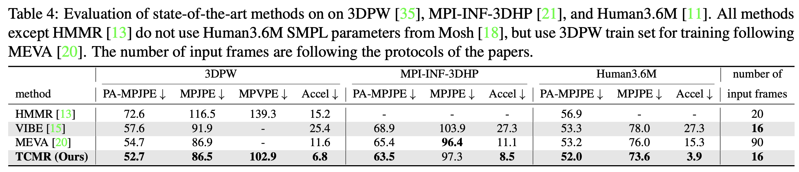
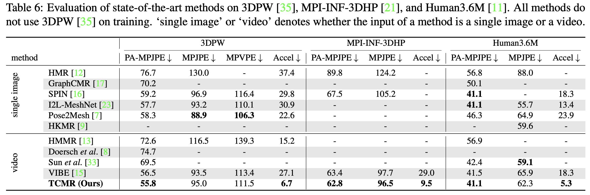

<div id="top"></div>

<!-- PROJECT LOGO -->
<br />
<div align="center">
  <a href="https://github.com/Glanfaloth/TCMR_RELEASE">
    
  </a>

  <h3 align="center">Human Pose Estimation from Egocentric Social Interaction Videos</h3>

  <p align="center">
    <br />
    <a href="https://github.com/Glanfaloth/TCMR_RELEASE">View Demo</a>
    ·
    <a href="https://github.com/Glanfaloth/TCMR_RELEASE/issues">Report Bug</a>
    ·
    <a href="https://github.comGlanfaloth/TCMR_RELEASE/issues">Request Feature</a>
  </p>
</div>


<!-- TABLE OF CONTENTS -->
<details>
  <summary>Table of Contents</summary>
  <ol>
    <li>
      <a href="#about-the-project">About The Project</a>
      <ul>
        <li><a href="#built-with">Built With</a></li>
      </ul>
    </li>
    <li>
      <a href="#getting-started">Getting Started</a>
      <ul>
        <li><a href="#prerequisites">Prerequisites</a></li>
        <li><a href="#installation">Installation</a></li>
      </ul>
    </li>
    <li><a href="#usage">Usage</a></li>
    <li><a href="#acknowledgments">Acknowledgments</a></li>
  </ol>
</details>


<!-- ABOUT THE PROJECT -->
## About The Project

[![Product Name Screen Shot][product-screenshot]](https://example.com)

The pose estimation with egocentric perspective is important for autonomous robot, augmented reality and health care. However, the dynamic movement, self-occlusion and self-motion in first-person view cause poor performance for the standard pose and shape estimator like Easymocap. In this work we integrate past and future information through PoseForecast module in TCMR. Moreover we design our custom regressor for keypoints estimation and also do extensive ablation study about different Pose Initialization strategy. We achieved amazing performance compared to the YOU2ME original work which formulates camera wearer pose estimation as classification task. Lastly we fit the SMPL model based on estimated keypoints and gain smooth and accurate result compared to running shape estimation directly.

<p align="right">(<a href="#top">back to top</a>)</p>


### Built With

* [Next.js](https://nextjs.org/)

<p align="right">(<a href="#top">back to top</a>)</p>


<!-- GETTING STARTED -->
## Getting Started

This is an example of how you may give instructions on setting up your project locally.
To get a local copy up and running follow these simple example steps.

### Prerequisites

This is an example of how to list things you need to use the software and how to install them.
* npm
  ```sh
  npm install npm@latest -g
  ```

### Installation

_Below is an example of how you can instruct your audience on installing and setting up your app. This template doesn't rely on any external dependencies or services._

1. Get a free API Key at [https://example.com](https://example.com)
2. Clone the repo
   ```sh
   git clone https://github.com/your_username_/Project-Name.git
   ```
3. Install NPM packages
   ```sh
   npm install
   ```
4. Enter your API in `config.js`
   ```js
   const API_KEY = 'ENTER YOUR API';
   ```

<p align="right">(<a href="#top">back to top</a>)</p>


<!-- USAGE EXAMPLES -->
## Usage

Use this space to show useful examples of how a project can be used. Additional screenshots, code examples and demos work well in this space. You may also link to more resources.

_For more examples, please refer to the [Documentation](https://example.com)_

<p align="right">(<a href="#top">back to top</a>)</p>

<!-- ACKNOWLEDGMENTS -->
## Demo


<p align="right">(<a href="#top">back to top</a>)</p>


<!-- MARKDOWN LINKS & IMAGES -->
<!-- https://www.markdownguide.org/basic-syntax/#reference-style-links -->
[contributors-shield]: https://img.shields.io/github/contributors/othneildrew/Best-README-Template.svg?style=for-the-badge
[contributors-url]: https://github.com/othneildrew/Best-README-Template/graphs/contributors
[forks-shield]: https://img.shields.io/github/forks/othneildrew/Best-README-Template.svg?style=for-the-badge
[forks-url]: https://github.com/othneildrew/Best-README-Template/network/members
[stars-shield]: https://img.shields.io/github/stars/othneildrew/Best-README-Template.svg?style=for-the-badge
[stars-url]: https://github.com/othneildrew/Best-README-Template/stargazers
[issues-shield]: https://img.shields.io/github/issues/othneildrew/Best-README-Template.svg?style=for-the-badge
[issues-url]: https://github.com/othneildrew/Best-README-Template/issues
[license-shield]: https://img.shields.io/github/license/othneildrew/Best-README-Template.svg?style=for-the-badge
[license-url]: https://github.com/othneildrew/Best-README-Template/blob/master/LICENSE.txt
[linkedin-shield]: https://img.shields.io/badge/-LinkedIn-black.svg?style=for-the-badge&logo=linkedin&colorB=555
[linkedin-url]: https://linkedin.com/in/othneildrew
[product-screenshot]: images/screenshot.png
<!-- # TCMR: Beyond Static Features for Temporally Consistent 3D Human Pose and Shape from a Video
| Qualtitative result  | Paper teaser video |
| ------------- | ------------- |
|  |  |

## Introduction
This repository is the official [Pytorch](https://pytorch.org/) implementation of [Beyond Static Features for Temporally Consistent 3D Human Pose and Shape from a Video](https://arxiv.org/abs/2011.08627). 
The base codes are largely borrowed from [VIBE](https://github.com/mkocabas/VIBE).
Find more qualitative results [here](https://youtu.be/WB3nTnSQDII).

## Installation
TCMR is tested on Ubuntu 16.04 with Pytorch 1.4 and Python 3.7.10. 
You may need sudo privilege for the installation.
```bash
source scripts/install_pip.sh
```
If you have a problem related to `torchgeometry`, please check [this](https://github.com/mks0601/I2L-MeshNet_RELEASE/issues/6#issuecomment-675152527) out.

## Quick demo
- Download the pre-trained demo TCMR and required data by below command and download SMPL layers from [here](https://smpl.is.tue.mpg.de/en) (male&female) and [here](http://smplify.is.tue.mpg.de/) (neutral). Put SMPL layers (pkl files) under `${ROOT}/data/base_data/`.
```bash
source scripts/get_base_data.sh
```
- Run demo with options (e.g. render on plain background). See more option details in bottom lines of `demo.py`.
- A video overlayed with rendered meshes will be saved in `${ROOT}/output/demo_output/`. 
```bash
python demo.py --vid_file demo.mp4 --gpu 0 
```

## Results
Here I report the performance of TCMR.





See [our paper](https://arxiv.org/abs/2011.08627) for more details.

## Running TCMR

Download pre-processed data (except InstaVariety dataset) from [here](https://drive.google.com/drive/folders/1oG-vyE77jHUgdTu9tApJuMj8voJ7lklD?usp=sharing).
You may also download datasets from sources and pre-process yourself. Refer to [this](asset/data.md).
Put SMPL layers (pkl files) under `${ROOT}/data/base_data/`.

The data directory structure should follow the below hierarchy.
```
${ROOT}  
|-- data  
|   |-- base_data  
|   |-- preprocessed_data  
|   |-- pretrained_models
```

### Evaluation

- Download pre-trained TCMR weights from [here](https://drive.google.com/drive/folders/1a_nv8MfvToutatBvKaIXP7J_7U4BjSu2?usp=sharing).  
- Run the evaluation code with a corresponding config file to reproduce the performance in the tables of [our paper](https://arxiv.org/abs/2011.08627).
```bash
# dataset: 3dpw, mpii3d, h36m 
python evaluate.py --dataset 3dpw --cfg ./configs/repr_table4_3dpw_model.yaml --gpu 0 
```
- You may test options such as average filtering and rendering. See the bottom lines of `${ROOT}/lib/core/config.py`.
- We checked rendering results of TCMR on 3DPW validation and test sets.

### Reproduction (Training)

- Run the training code with a corresponding config file to reproduce the performance in the tables of [our paper](https://arxiv.org/abs/2011.08627).
- There is a [hard coding](https://github.com/hongsukchoi/TCMR_RELEASE/blob/46462c664f1057fb3c14e2049a377e6bc071d622/lib/dataset/_dataset_3d.py#L92) related to the config file's name. Please use the exact config file to reproduce, instead of changing the content of the default config file.
```bash
# training outputs are saved in `experiments` directory
# mkdir experiments
python train.py --cfg ./configs/repr_table4_3dpw_model.yaml --gpu 0 
```
- After the training, the checkpoints are saved in `${ROOT}/experiments/{date_of_training}/`. Change the config file's `TRAIN.PRETRAINED` with the checkpoint path (either `checkpoint.pth.tar` or `model_best.pth.tar`) and follow the evaluation command.
- You may test the motion discriminator introduced in VIBE by uncommenting the codes that have `exclude motion discriminator` notations.
- We do not release [NeuralAnnot](https://arxiv.org/abs/2011.11232) SMPL annotations of [Human36M](http://vision.imar.ro/human3.6m/description.php) used in our paper yet. Thus the performance in Table 6 may be slightly different with the paper.


## Reference
```
@InProceedings{choi2020beyond,
  title={Beyond Static Features for Temporally Consistent 3D Human Pose and Shape from a Video},
  author={Choi, Hongsuk and Moon, Gyeongsik and Lee, Kyoung Mu},
  booktitle = {Conference on Computer Vision and Pattern Recognition (CVPR)}
  year={2021}
}
```

## License
This project is licensed under the terms of the MIT license.
 -->
